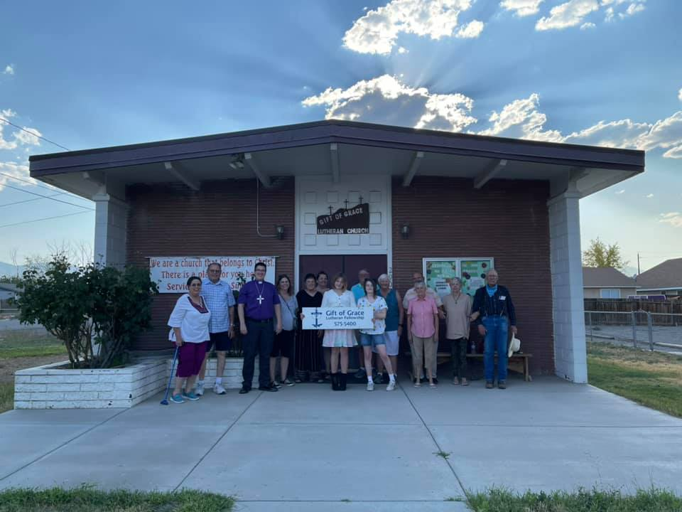

---
# Feel free to add content and custom Front Matter to this file.
# To modify the layout, see https://jekyllrb.com/docs/themes/#overriding-theme-defaults

#layout: home

layout: home

---

## Mission Statement

_It is our purpose to live in God's gift of grace,_

_work to make disciples of Christ,_

_and serve the needs of others in the world._

## Vision of Gift of Grace

​We envision Gift of Grace Lutheran Church as a Christian family of God’s grace committed to sharing the Gospel and serving others through joyful worship, prayer, education, fellowship and outreach.  

Gift of Grace is affiliated with the Evangelical Lutheran Church in America (ELCA) and a member of the Sierra Pacific Synod.

God's Blessings to you.

## Worship Schedule

Children are always welcome at our worship service.
* Sunday School, during 10 AM  service, in the Sacristy, during the school year
* ​10 AM worship in the Sanctuary 
* 11 AM Fellowship in the Fellowship Hall of the Lutheran Center
* Please contact 775-524-4438 if you are home bound or a "shut in", or know someone who is, and would like to partake of Holy Communion.

## Bible Verse of the Day

<!-- alternative for no javascript -->
<noscript>
<iframe framespacing="0" frameborder="no" src="https://www.biblegateway.com/votd/get?format=html&version=NIV">View Verse of the Day</iframe> 
</noscript>

<!-- MailerLite Universal -->

<!-- End MailerLite Universal -->

<!-- MailerLite signup -->

<!-- End MailerLite signup -->

## Previous Newsletters

* [April](https://preview.mailerlite.io/preview/623765/emails/180787784860042945)
* [March](https://preview.mailerlite.io/preview/623765/emails/177637622185723325)
* [February](https://preview.mailerlite.io/preview/623765/emails/175100409423070711)
* [January](https://preview.mailerlite.io/preview/623765/emails/172836056862819748)
* [December](https://preview.mailerlite.io/preview/623765/emails/169365261791528331)
* [November](https://preview.mailerlite.io/preview/623765/emails/166847109298915207)
* [October](https://preview.mailerlite.io/preview/623765/emails/163866700559681298)
* [September](https://preview.mailerlite.io/preview/623765/emails/161144387353445465)
* [August](https://preview.mailerlite.io/preview/623765/emails/158583453330179913)
* [July](https://preview.mailerlite.io/preview/623765/emails/156046733707576702)
* [June](https://preview.mailerlite.io/preview/623765/emails/152895127914808353)
* [May](https://preview.mailerlite.io/preview/623765/emails/150510462176331695)

## Recorded Sermons on Facebook

[Click here for recorded Sermons](https://www.facebook.com/watch/giftofgracefernley/)

# New Location

## Directions
* From The Wigwam, head toward Exit 46, driving past Love’s and Pilot toward Wadsworth
* Stay on the main road, into Wadsworth
* As you enter town, cross the Truckee River, with a railroad bridge on your right
* Immediately after the bridge, turn right onto Virginia Street
* As the road forks, follow the road to the left
* Continue on this road through the neighborhood
* Near the end, you’ll see a playground on your right
* After the playground, the road makes a sharp right.  Go slightly left into the Church parking lot instead of following the turn 

<iframe src="https://www.google.com/maps/embed?pb=!1m18!1m12!1m3!1d768.1150116456133!2d-119.28626907140732!3d39.63935989821606!2m3!1f0!2f0!3f0!3m2!1i1024!2i768!4f13.1!3m3!1m2!1s0x8098dc539f49cc6b%3A0xc41cf27edba7ff54!2sSt%20Michael%20%26%20All%20Angels!5e0!3m2!1sen!2sus!4v1779576019374!5m2!1sen!2sus" width="1000" height="450" style="border:0;" allowfullscreen="" loading="lazy" referrerpolicy="no-referrer-when-downgrade"></iframe>

## Gift of Grace Lutheran Church
* Location: 444 Reservation Rd, Wadsworth, NV 89442
* Mailing Address: PO Box 1041, Fernley, NV 89408
* Phone:  775-524-4438
* Website:  www.gift-of-grace.org
* e-mail: office@gift-of-grace.org
